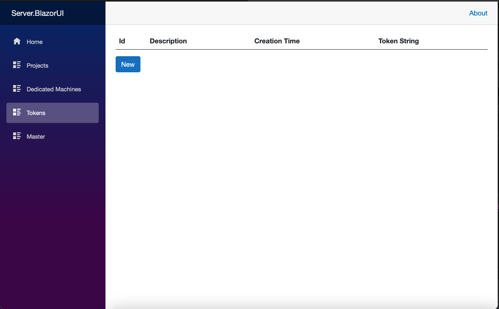
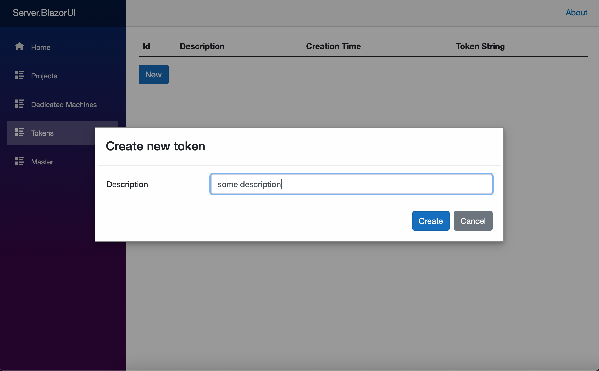
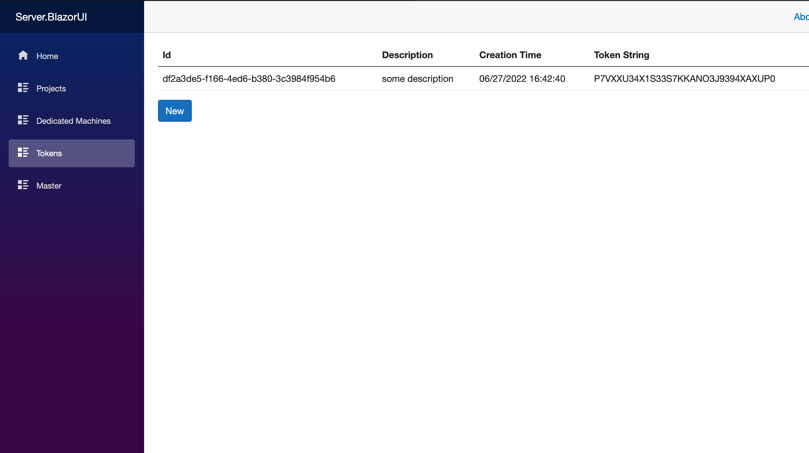
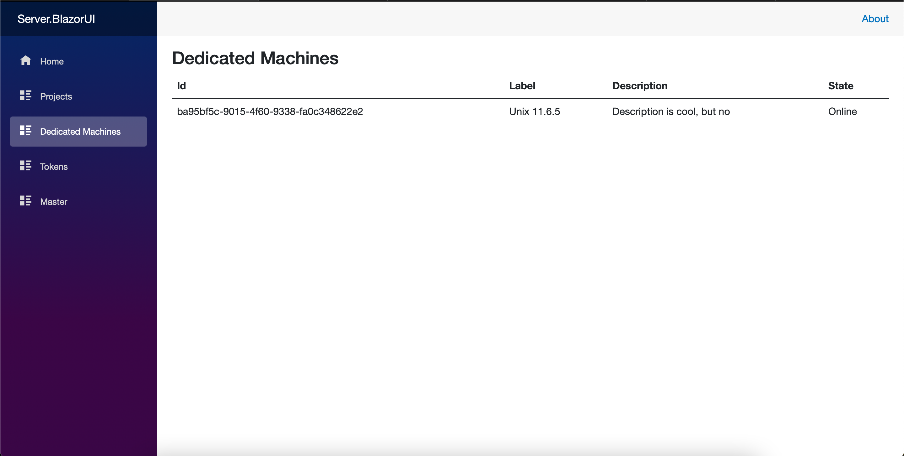
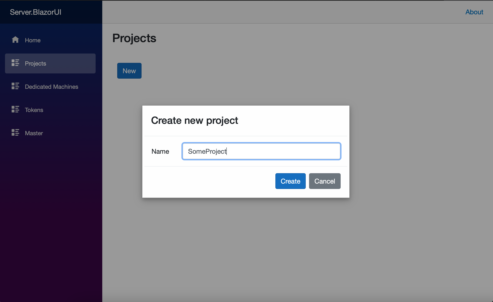
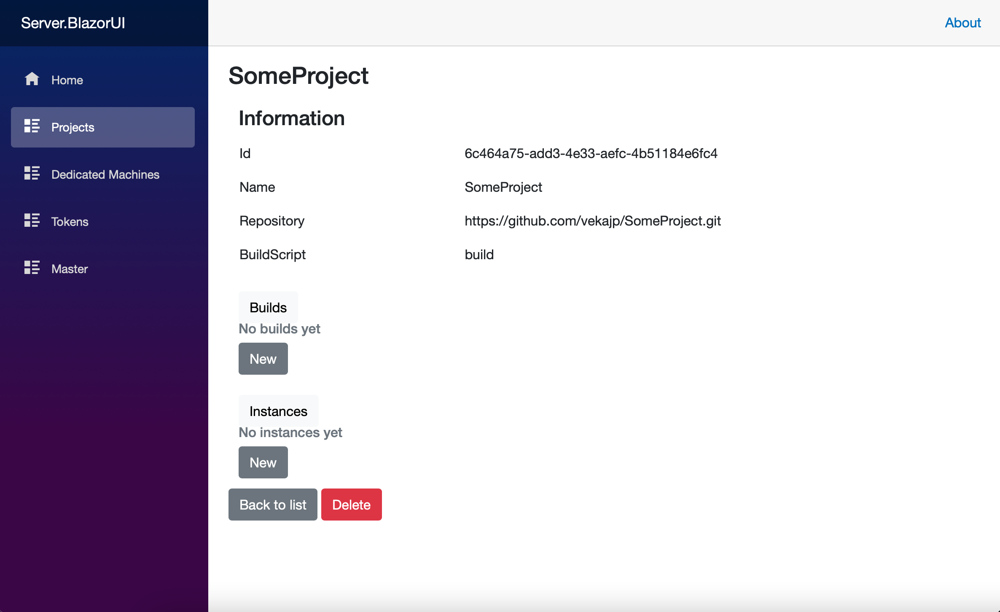
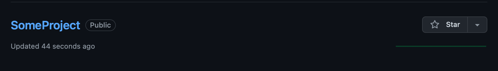

# Private CI/CD service

## 💡 Идея

## ✔️ Задачи и цели

 - Реализовать функционал, позволяющий автоматизировать процесс деплоя.

## 📖 Описание проекта

Проект состоит из трех компонент: 
- **Server/Ui** представляет собой Api для управления проектами, токенами, билдами и инстансами.
- **ProjectService** вызывает GitHub API, создает репозитории, билдит проект.
- **Instance manager** представляет собой программу на сервере, которая запускает приложение пользователя.

## ✅ Current state

- Подключение и авторизация(при помощи токена) удаленной машины.
- Создание проекта и соотвествующего репозитория.
- Автоматическое создание билда при обновлении репозитория.
- Создание инстанса через ui и возможность наблюдать за сменой состояний: installing, running, stoped.

## 🦮 Гайд по запуску

- Запускаем Server.Api и Server.BlazorUi из пректа server 
- Переходим на страницу Tockens

Генериуем новый токен для подключения удаленной машины

Копируем токен. Для подключения удаленной машины достаточно запустить Instance manager со следующими аргументами:

- Публичный ip сервера, на котором запущен Server.Api
- Порт, принимающий соединения удаленных машин(выводится в консоль при запуске)
- Сгенерированный токен

После запуска в разделе Dedeicated machines полявится удаленная машина

Теперь эта машина доступна для запуска на ней инстансов.

Для создания проекта нужно запустить ProjectService.WebApi.
Для запуска приложения нужно сначала настроить кофигурацию в ProjectService.WebApi
appsettings.json:

    {
        "ProjectServiceApiUrl" : "Внешний uri адрес нашего клиента",
        "GithubOrganization" : "Название организации, если нужно писать в юзера оставляем пустые",
        "GithubUsername" : "имя пользователя github",
        "GithubToken" : "токен",
        "ServerAddress" : "uri сервера",
        "TempPath" : "путь к временной папке",
        "RepositoryPath" : "путь к папке-репозиторию",
        "ConnectionString" : "коннекшн стринга для mssql server"
    }

Создадим проект:

Созданный репозиторий на гитхабе

## ✨Перспективы дальнейшей разработки✨

- Создание проекта из шаблона
- Получение логов удаленной машины
- Система авторизации и аутентификации пользователя